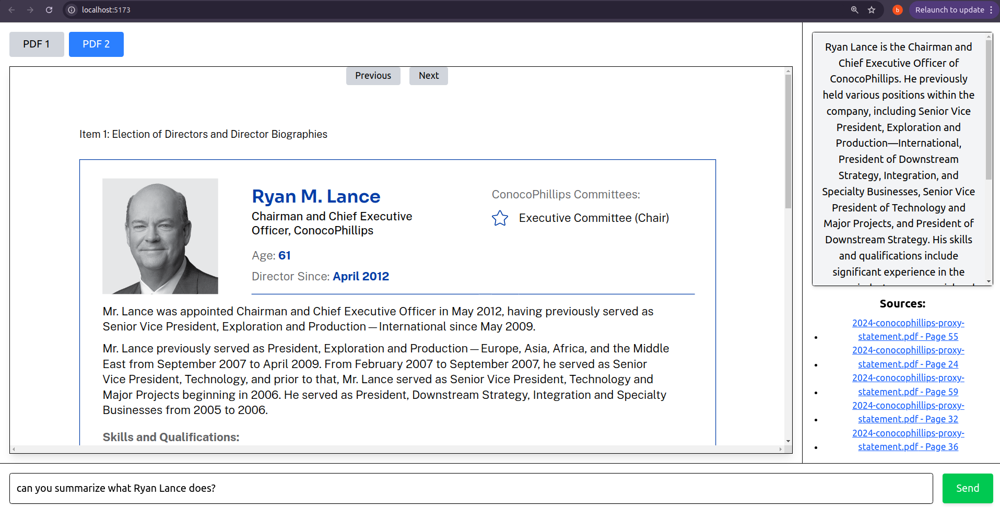

# RAG Market Research Tool - Frontend

 <!-- Replace with an actual image filename -->

## Overview

This is the frontend for the **RAG Market Research Tool**, a system that enables users to analyze and compare market research reports using AI-powered interactions. The frontend provides an intuitive **React-based** UI for viewing PDF documents, submitting queries, and retrieving AI-generated insights with **clickable sources** that allow users to jump directly to relevant pages in the reports.

This project integrates with the [RAG Backend](https://github.com/hari9-9/RAG-Backend), which powers the retrieval, AI response generation, and source citation functionality.

---

## Features

- 📄 **PDF Viewer** – Allows users to view and navigate through research reports.
- 🔍 **AI-Powered Insights** – Fetches relevant responses and sources based on user queries.
- 🔗 **Clickable Sources** – AI citations are interactive; clicking on a source directs the user to the correct PDF and page number.
- 🔄 **Dynamic Page Navigation** – Keeps track of the last viewed page for each document.
- ⚡ **Fast & Interactive UI** – Optimized with Tailwind CSS for a seamless user experience.
- 🌐 **API Integration** – Communicates with the backend to fetch AI-generated insights.

---

## Tech Stack

### **Frontend**
- **Framework**: React (Vite + TypeScript)
- **State Management**: useState hooks
- **UI Styling**: Tailwind CSS
- **PDF Processing**: react-pdf
- **API Requests**: Fetch API

### **Backend**
This frontend is designed to work with the **FastAPI-based RAG Backend**:
- **LLM Integration**: Hugging Face
- **Vector Search**: FAISS
- **PDF Processing**: pdfplumber
- **Retrieval Ranking**: BM25

For more details on the backend, visit: [RAG Backend Repository](https://github.com/hari9-9/RAG-Backend).

---

## Installation & Setup

### 1. Clone the Repository
```sh
git clone https://github.com/your-username/rag-market-research-frontend.git
cd rag-market-research-frontend
```

### 2. Install Dependencies
```sh
npm install
```

### 3. Start the Development Server
```sh
npm run dev
```
By default, the frontend runs on **http://localhost:5173**.

### 4. Connect to Backend
Ensure the **[RAG Backend](https://github.com/hari9-9/RAG-Backend)** is running at `http://localhost:8000` before making queries.

---

## Usage

1. **View PDFs** – Click on the tabs to switch between different research reports.
2. **Submit Queries** – Type a query in the input box and hit "Send" to retrieve AI-generated insights.
3. **Navigate Sources** – Click on cited sources to jump directly to the relevant page in the PDF.
4. **Switch Between Reports** – The app maintains the last viewed page for each document.

---

## Clickable Sources Feature

- When AI provides a response, it includes citations from the original PDFs.
- These citations are **interactive links**; clicking on a source will switch to the correct PDF and open the exact page number.
- This ensures **transparency** and **easy verification** of AI-generated content.

**Example:**
If AI suggests: *"The company's revenue for 2023 was $10 billion."*, it will include a source like:

```
Sources:
[2023-conocophillips-aim-presentation.pdf - Page 3](#)
```

Clicking the source will switch the active PDF to *"2023-conocophillips-aim-presentation.pdf"* and navigate to **Page 3** automatically.

---

## Folder Structure

```
src/
│── components/
│   ├── PdfReactPdf.tsx       # PDF viewer component
│   ├── PdfViewerPage.tsx     # Main PDF viewer page with query section
│   ├── TextInputSection.tsx  # Input section for submitting queries
│── assets/                   # Folder to store PDFs
│── App.tsx                   # Main application entry point
│── main.tsx                  # React application setup
│── styles/                    # Tailwind CSS and global styles
```

---

## Future Enhancements
- 📊 **Graphical Insights** – Displaying AI-generated data as charts.
- 📚 **Multi-Document Support** – Compare multiple reports side by side.
- 🚀 **Performance Optimization** – Improve retrieval and UI responsiveness.

---

## Related Projects
- 🔗 **Backend API**: [RAG Backend Repository](https://github.com/hari9-9/RAG-Backend)

This frontend provides a seamless way to interact with AI-powered market research reports. Make sure to check out the backend for more advanced retrieval and processing features.

